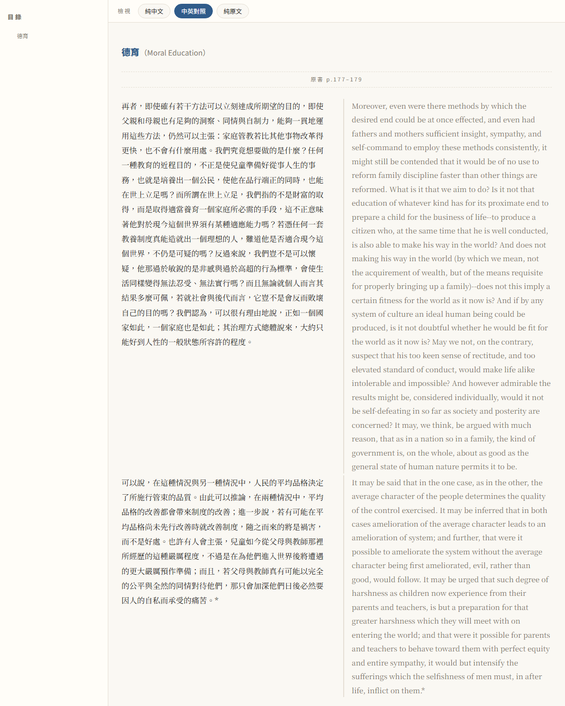

# translate-academic-paper

把**學術論文或人文專著的 PDF**，翻譯成一份**單一自包含的 HTML**——頂部可切換
**純中文 / 中英對照 / 純原文**三種檢視，圖片、公式、掃描原頁全部 base64 內嵌，零外部相依，
可直接傳給任何人。輸出為**繁體中文（台灣用語）**。

原為 [Claude Code](https://claude.com/claude-code) 的 skill，但**廠商中立**：任何能操作檔案、
執行 shell 的 agent（Claude / Gemini / GPT / 本地模型，搭配 Cursor / Cline / Aider / 各家 CLI）
都能照 [`references/runbook.md`](references/runbook.md) 獨立跑完。

> ⚠️ **硬規則：譯文必須由執行的模型親自逐段翻譯，禁止外包給機器翻譯 API/工具。**
> 部分 coding agent 會為「效率」偷接 MT 服務或另開 LLM 代翻，也會在長章節上悄悄
> 濃縮成摘要交差（實測真的發生過：60 頁章節只給 9 段）。交接時請一併貼上
> [`runbook.md` 的「交接強化句」](references/runbook.md)，並在**每章翻完後強制跑**
> `scripts/check_translation.py` 品質關卡，FAIL 就打回重譯，不要靠事後肉眼複查整本。

> ⚠️ **不建議在 Claude（Anthropic 代管 API）上執行翻譯步驟。** 實測翻譯 19 世紀
> 公有領域經典（含當時的殖民/種族/性別用語、體罰描述）時，Anthropic 的**輸出端
> 內容過濾器會反覆誤判並攔截輸出**（回 400，連寫檔都被擋），偵察、腳本、QA、合併
> 等其餘步驟不受影響。**翻譯與原文轉錄請交給過濾較寬鬆的模型執行**（本 skill 廠商中立，
> 照 runbook 即可交接）；現代技術論文通常無此問題。

## 概念驗證（PoC）狀態

本 skill 的 B2 批次流程已於 **GPT-5.5（Codex）環境**下，以
**Spencer《Education: Intellectual, Moral, and Physical》(D. Appleton, 1894)**
——309 頁、19 世紀老字體、含前任讀者手寫批註的掃描書——完成概念驗證：
sec03 試譯批（p.177–182，含跨頁段落與跨頁腳註）與 sec02 兩個正式批（p.94–112）
經對照頁面圖逐段驗收通過（忠實度、段落邊界、腳註歸位、批註排除）。

各分級實測狀況：

| 級別 | 定義 | 驗證狀況 |
|------|------|----------|
| **A** 原生電子檔 | 有正常文字層 | ✅ 已驗證（現代論文，本 skill 原始流程）|
| **B1** 乾淨掃描 | OCR 錯誤 ≲3 處/頁 | ⚠️ 流程同 A + 對圖抽查，尚無完整實測案例 |
| **B2** 髒掃描 | OCR 錯誤 >3 處/頁、老字體、手寫批註 | ✅ 已驗證（Spencer 1894，GPT-5.5 環境）|
| **C** 無文字層 | 掃描無 OCR | ⚠️ 看圖直譯流程可用，尚無整本書實測 |

成品效果（sec03 試譯，中英對照檢視）：



## 特色

- **文件分類 A/B1/B2/C**：原生電子檔 / 乾淨掃描 / 髒掃描 / 無文字層，自動判定＋髒度判級分流。
- **B2 批次流程**：老書掃描走「OCR=定位器、頁面圖=證據」的分層批次管線（translation units JSON 為正典、批批 QA、接縫驗證），詳見 runbook §B2。
- **看圖直譯**：掃描檔用頁面圖翻譯（不跑 Tesseract，避免 OCR 錯字污染），適合古籍與低品質掃描。
- **雙欄還原**：會議論文的雙欄版面自動還原正確閱讀順序，輸出統一單欄。
- **術語詞庫**：先查標準譯法（台灣繁中慣例）再鎖定，全文一致；模型/資料集專名保留原文。
- **圖表 / 公式**：caption 錨點擷取圖表；公式以原圖截圖內嵌，保證與原文一致。
- **書目 header**：論文（作者/單位/期刊·卷期/DOI）與專著（出版社/出版地/版次/ISBN）皆可。
- **三態檢視**：一份 HTML，純中 / 對照 / 純原文即時切換；內建列印樣式。
- **多格式輸出**：自包含 HTML 為主，另可選擇輸出 Word `.docx`（純中 / 對照 / 純原文）。
- **品質關卡**：每章翻完自動檢查抽稿／缺原文對照／頁碼跳號逆行／簡體字混入，不合格擋下重譯。

## 快速開始

```bash
pip install pymupdf pillow

# 1) 偵察：判定 A/B/C、offset、欄數、章節、書目
python scripts/inspect_pdf.py "TARGET.pdf"

# 2) 依 references/runbook.md 逐段翻成 build/secNN.html（翻譯單位是「段落」）
#    書目寫成 build/meta.html
#    每章翻完立刻跑品質關卡（強制）：
python scripts/check_translation.py build/secNN.html --min-page N1 --max-page N2

# 3) 合併成單一 HTML（建議輸出到 out/，與 build/ 分開）
python scripts/combine_paper.py --build build --out "out/成品_中譯.html" --default-view both

# 3b) （選用）另外輸出 Word .docx
python scripts/export_docx.py --build build --out "out/成品_中譯.docx" --view zh
```

完整流程見 [`SKILL.md`](SKILL.md)；照著跑的操作手冊見 [`references/runbook.md`](references/runbook.md)。

## 結構

```
SKILL.md                  主工作流程
references/
  runbook.md              可攜執行手冊（任何 agent 照著跑）
  methodology.md          翻譯方法論（技術論文 vs 人文論說文；敏感史料）
  glossary-guide.md       詞庫建立與標準譯法查證
  css-template.md         HTML 結構、書目 header、對照/圖/公式模板
  pipeline-notes.md       腳本原理、A/B/C 判定、雙欄與圖表調參
scripts/                  8 支腳本（偵察 / 抽文 / 渲染 / 品質關卡 / 圖表 / 公式 / 合併 / docx）
```

## 目標語言

目前核心針對**繁體中文（台灣用語）**最佳化（兩岸用語對照、學術名詞查證、Noto Serif TC 字型）。
架構為語言中立的管線 + 可插拔的語言設定，未來要支援其他目標語言時，新增一份方法論與字型設定即可，
毋須改動抽取／合併流程。歡迎 PR。

## 授權

[MIT](LICENSE) © 2026 Zaious。可自由取用、修改、散布，惟須保留著作權聲明。
